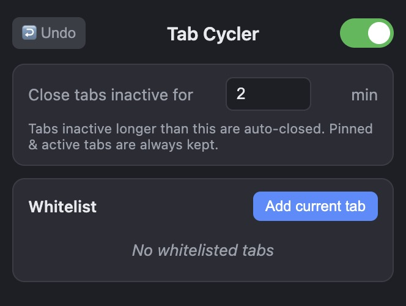

# Tab Cycler

A minimal Chrome / Helium (Manifest V3) extension that **quietly closes tabs
you're not using** after a timeout — then lets you undo it with one click.
Built for Zen, not notifications.

## Features

- **Auto-close inactive tabs** — any tab idle longer than the timeout is closed
  (pinned, active, and whitelisted tabs are always kept).
- **One-click Undo** — the `↩️` button restores the last batch of closed tabs to
  their original windows and positions. Greyed out when there's nothing to undo.
- **On/off toggle** — flip the whole thing off from the toolbar popup.
- **Whitelist** — protect specific tabs (`Add current tab`) from ever being closed.
- **Configurable timeout** — default 15 minutes.

## Install

1. Open `chrome://extensions` (or Helium's equivalent).
2. Enable **Developer mode**.
3. Click **Load unpacked** and select this `tab-cycler` folder.

## Usage

Open the toolbar popup to toggle the extension, set the inactivity timeout, or
whitelist the current tab. When a sweep closes tabs, the `↩️ Undo` button lights
up — click it to bring them back.

## License

[MIT](LICENSE)